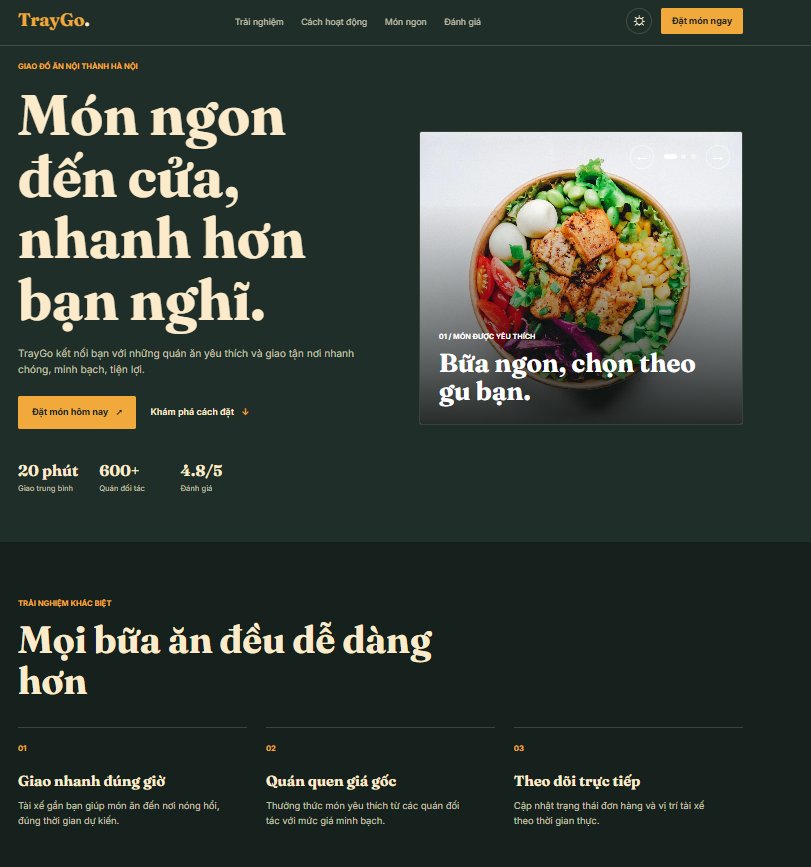
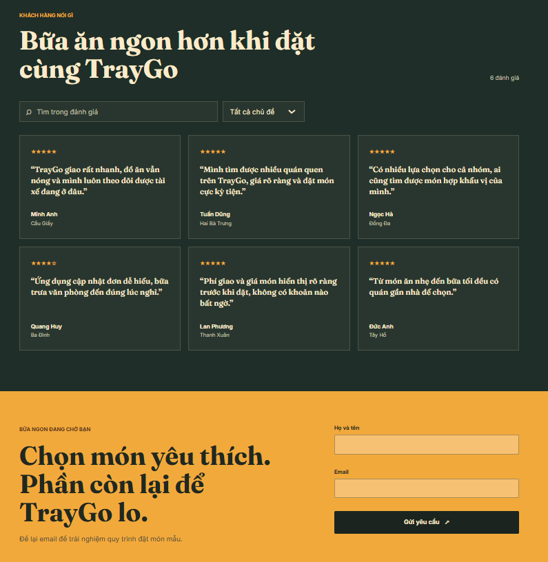

# Báo cáo bài tập Ex2 - JavaScript cơ bản

**Sinh viên:** Phạm Quang Anh  
**Mã sinh viên:** 20252292M  
**Chủ đề:** Bổ sung tương tác JavaScript thuần cho landing page TrayGo

## 1. Mục tiêu

Bài tập tiếp nối landing page giao đồ ăn TrayGo ở Ex1. Giao diện được giữ cùng nhận diện thương hiệu, sau đó bổ sung các tương tác bằng HTML, CSS và JavaScript thuần, không dùng framework hay thư viện JavaScript bên ngoài.

## 2. Cấu trúc và cách chạy

- `index.html`: nội dung landing page, điều hướng, slider, bộ lọc đánh giá và form.
- `style.css`: giao diện responsive, trạng thái theme sáng/tối và các trạng thái tương tác.
- `script.js`: xử lý menu, scrollspy, slider, dữ liệu đánh giá, tìm kiếm, lọc, theme và kiểm tra form.

Mở trực tiếp `index.html` bằng trình duyệt để sử dụng. Google Fonts và ảnh món ăn lấy từ Unsplash nên cần kết nối Internet để tải các tài nguyên này; các chức năng JavaScript vẫn chạy khi không có mạng.

### Hình ảnh giao diện

## 3. Các yêu cầu đã thực hiện

| Yêu cầu | Cách triển khai |
| --- | --- |
| Menu tương tác | Nút menu trên màn hình nhỏ bật/tắt danh sách điều hướng và cập nhật `aria-expanded`. |
| Đánh dấu mục đang xem | Sự kiện `scroll` kết hợp `requestAnimationFrame`, `getBoundingClientRect()` và danh sách section để cập nhật mục active. |
| Kiểm tra dữ liệu form | Form kiểm tra họ tên, email rỗng và định dạng email; lỗi được hiển thị ngay dưới trường tương ứng. |
| Slider ảnh tự viết | Ba ảnh món ăn, nút trước/sau và các chấm chọn slide, không sử dụng thư viện. |
| Theme sáng/tối | Nút chuyển theme cập nhật thuộc tính `data-theme`; lựa chọn được lưu và đọc từ `localStorage`. |
| Nội dung render linh động | Sáu đánh giá được khai báo trong mảng object JavaScript; `renderItems(data)` dùng `map()` và DOM API để tạo card. |
| Tìm kiếm và lọc | Tìm theo tên, địa điểm, nội dung và lọc theo chủ đề; kết quả render lại ngay, không tải lại trang. |

Form chỉ kiểm tra dữ liệu và hiển thị xác nhận ở phía trình duyệt; bài tập chưa kết nối dịch vụ gửi email hoặc máy chủ lưu yêu cầu.

## 4. Nhật ký Vibe Coding (AI Log)

Các prompt bên dưới được biên soạn lại để mô tả những yêu cầu có thể dẫn tới phiên bản hoàn thiện hiện tại; đây là bản tổng hợp phục vụ báo cáo, không phải bản chép nguyên văn lịch sử hội thoại.

### Vòng 1 - Xây dựng logic cốt lõi

**Prompt:**

> **[Context]** Tôi đang làm bài tập JavaScript cơ bản, tiếp nối landing page TrayGo đã xây dựng bằng HTML và CSS ở Ex1. Landing page giới thiệu dịch vụ giao đồ ăn tại Hà Nội.
>
> **[Role]** Bạn là lập trình viên Front-end, ưu tiên JavaScript thuần, HTML ngữ nghĩa và khả năng truy cập.
>
> **[Action]** Hãy tạo phiên bản Ex2 độc lập từ landing page hiện có. Bổ sung menu responsive bật/tắt bằng click; navigation tự active theo section đang xem; form nhận họ tên và email có thông báo lỗi inline; slider ảnh có nút trước/sau và chấm chọn; theme sáng/tối lưu bằng localStorage. Chọn phần đánh giá làm nội dung động: khai báo mảng object, viết `renderItems(data)` dùng `map()` và DOM API, thêm tìm kiếm và lọc chủ đề cập nhật tức thì.
>
> **[Format]** Tách mã thành `index.html`, `style.css`, `script.js`; không thêm framework hoặc thư viện JavaScript. Tạo `report.md` bằng tiếng Việt mô tả setup, tính năng và AI Log.
>
> **[Target]** Giữ phong cách TrayGo của Ex1, hiển thị tốt trên điện thoại và desktop; tránh hardcode các review trong HTML, có trạng thái rỗng cho bộ lọc và thông báo lỗi dễ hiểu cho form.

### Vòng 2 - Debug và refactor

**Prompt:**

> **[Context]** Tôi đã có landing page với menu mobile, scrollspy, slider, theme, form và danh sách review render từ JavaScript.
>
> **[Role]** Hãy rà soát như một reviewer Front-end, tập trung vào lỗi hành vi, responsive và accessibility.
>
> **[Action]** Kiểm tra menu có đóng sau khi chọn liên kết không; slider có đồng bộ ảnh đang hiện, trạng thái `aria-hidden` và chấm chọn không; scrollspy có tránh xử lý lặp dày khi cuộn không; form có chặn gửi khi thiếu tên hoặc email sai không; bộ lọc có xử lý trường hợp không có kết quả không. Sửa trực tiếp những điểm chưa nhất quán và tránh lặp logic không cần thiết.
>
> **[Format]** Giữ nguyên cấu trúc ba file HTML/CSS/JS, không đổi công nghệ hoặc làm lại nội dung không liên quan. Nêu các kiểm tra thủ công sau khi sửa.
>
> **[Target]** Các trạng thái phải nhất quán giữa giao diện và ARIA; thao tác tìm kiếm/lọc không reload trang; layout không tràn ngang ở màn hình nhỏ.

### Vòng 3 - Tối ưu và giải thích

**Prompt:**

> **[Context]** Đây là bài thực hành JavaScript thuần cho landing page TrayGo. Các tính năng chính đã hoàn thành, tôi cần hoàn thiện chất lượng và phần báo cáo nộp bài.
>
> **[Role]** Bạn là người hướng dẫn JavaScript, giải thích rõ cho sinh viên đang học DOM và event.
>
> **[Action]** Tối ưu cập nhật scrollspy để không chạy đo layout liên tục trong mỗi sự kiện scroll; bảo đảm theme có giá trị mặc định nếu localStorage không dùng được; dùng `textContent`/DOM API khi đưa nội dung review vào trang; bổ sung trạng thái rỗng và thông báo submit thành công. Trong báo cáo, giải thích ngắn gọn vai trò của `map()`, `filter()`, `requestAnimationFrame`, event listener và localStorage.
>
> **[Format]** Cập nhật mã tại chỗ, giữ JavaScript thuần; bổ sung checklist kiểm thử và ba vòng AI Log trong `report.md`.
>
> **[Target]** Mã dễ đọc, đáp ứng đầy đủ rubric của đề, có thể mở trực tiếp bằng trình duyệt và không tuyên bố đã kiểm thử những trường hợp chưa thực sự kiểm tra.

## 5. Quy trình kiểm thử

1. Mở `index.html`, xác nhận trang hiển thị và các ảnh tải được khi có mạng.
2. Thu nhỏ cửa sổ, mở menu, theo từng liên kết và xác nhận menu đóng; cuộn trang để xem mục navigation active thay đổi.
3. Chuyển theme, tải lại trang và xác nhận lựa chọn được giữ lại.
4. Dùng nút trước/sau và chấm chọn để đổi slide.
5. Tìm review bằng tên hoặc nội dung; thử từng chủ đề và thử từ khóa không có kết quả.
6. Gửi form để trống, nhập email sai, sau đó gửi dữ liệu hợp lệ; kiểm tra lỗi inline và thông báo thành công.

## 6. Một số điểm kỹ thuật

- `renderItems()` tạo các phần tử bằng `document.createElement()`, gán nội dung bằng `textContent`, rồi thay nội dung danh sách bằng `replaceChildren()`.
- `filterReviews()` kết hợp `filter()` trên chủ đề và từ khóa; sự kiện `input`/`change` gọi render ngay.
- `requestAnimationFrame()` gom cập nhật scrollspy theo khung hình để giảm công việc phát sinh từ sự kiện cuộn.
- Truy cập `localStorage` được bọc trong `try/catch`; giao diện vẫn sử dụng được nếu trình duyệt chặn lưu trữ.